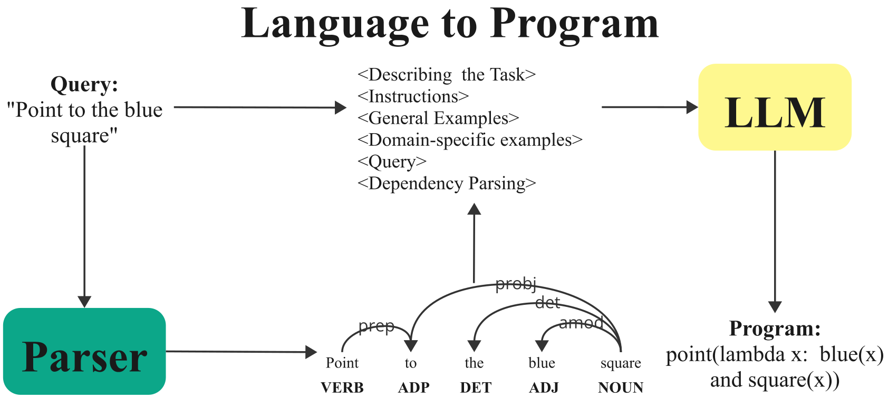
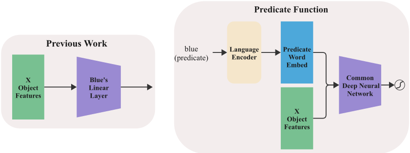
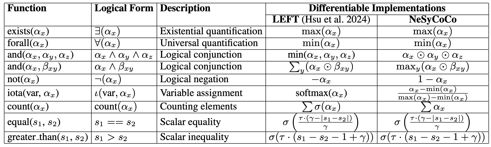
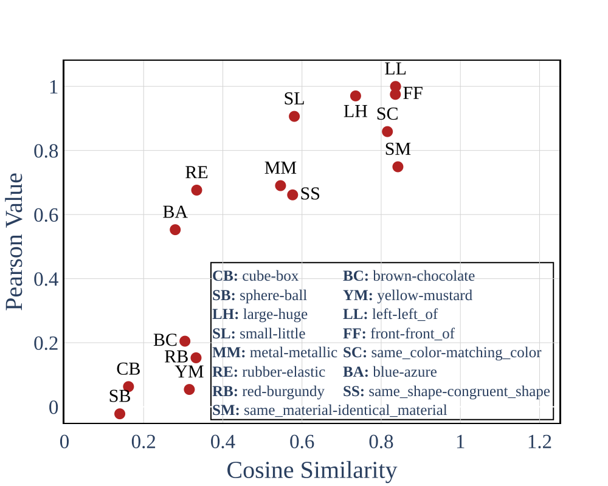
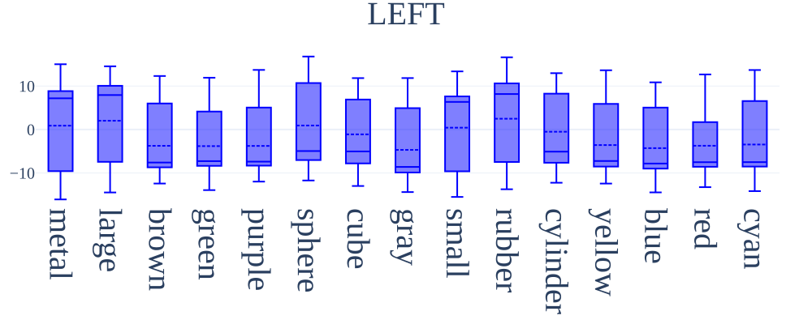
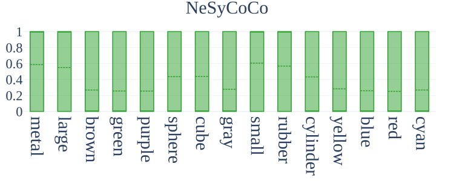

## **Abstract**
NeSyCoCo is a neuro-symbolic visual reasoning framework that tackles generalization in vision-language tasks and more specially **compositional generalization**.

**Highlights**:
- **State-of-the-Art Results**: Demonstrated on ReaSCAN, CLEVR-CoGenT, and CLEVR-SYN.
- **Novel Contributions**: Alleviating three main issues in neuro-symbolic vision-language reasoning.
    - **Predefined Predicates**: Generalizable predicate function to **handle language variety** and **concept generalization**.
    - **Language-to-Program Bottleneck**: Utilizing syntactic information for **improved language-to-symbolic program** generation.
    - **Concept Composition**: Proposing an improved set of functions for **more effective composition** in first-order logic.

---

### **Key Components**
- **Language-to-Program Module**: Converts natural language queries into symbolic programs using **dependency parsing**.
  

    
    
<em>Language-to-Program process</em>

  

- **Perception Module**: Extracts visual features and relationships from images via models like Mask RCNN.
- **Differentiable Executor**: Executes symbolic programs with soft composition for robust generalization.
  - **Predicate Functions**:
    

      
      
<em>Generalizable predicate function compared to LEFT</em>

    

  - **First-Order-Logic Function**
    

      
      
<em>FOL functions</em>

    

---

## **Key Results**

### **1. Compositional Generalization**
- **ReaSCAN Benchmark (Table 2)**:
    - Outperformed baselines with **97.3% accuracy** on relative clause and spatial reasoning splits.
- **CLEVR-CoGenT (Table 3)**:
    - Achieved **78.8% accuracy** on unseen attribute combinations in Split B.

---

### **2. Vision-Language Reasoning**
- **CLEVR Extensions**:
    - **CLEVR-RPM**: Perfect performance (**100% accuracy**) on relational reasoning tasks.
    - **CLEVR-Puzzle**: High accuracy (**95%**), demonstrating robustness in multi-step reasoning.
    - *Detailed results are shown in Table 5.*

---

### **3. Handling Predicate Language Variety**
- **CLEVR-SYN Benchmark (Table 7)**:
    - Showed strong zero-shot generalization to unseen synonyms (e.g., "huge" for "large").
    - Maintained **73.4% accuracy** on the hardest splits.

  
  
<em>Figure 5: Predicate Embeddings Similarity vs. Pearson Correlation of Predicate Score</em>

### 4. Why soft composition?
- **Comparison of Concept Scores**:
  - Presented boxplots compare concept scores of LEFT and NeSyCoCo using 10k CLEVR validation samples.

- **Variability in Score Ranges**:
  - Different concepts exhibit significantly varying score ranges, leading to inconsistencies.

- **Challenges with Min Function**:
  - **Undervaluation of Specific Concepts**:
    - When composing concepts (e.g., `red` and `rubber`) using a *min* function, the score for one concept (e.g., `red`) is often undervalued.
  - **Biased Composition**:
    - This undervaluation results in a biased composition that fails to accurately reflect the true relationship between the combined concepts.

- **Advantages of Soft Composition**:
    - **Normalized Predicate Scores**: Soft composition utilizes normalized predicate scores, mitigating the issues caused by varying score ranges.

  

    
  

  

    
  

<em>NeSyCoCo predicate score box plot compared to LEFT (Dotted and solid lines represent the mean and median, respectively) </em>

---

## **How NeSyCoCo Differs**
1. **Soft Predicate Composition**:
    - Unlike scalar scores in LEFT, NeSyCoCo employs **normalized predicate scores**, improving robustness (Figure 4).

2. **Dependency Parsing**:
    - Enhances program accuracy, especially for **nested queries** (Figure 2).

3. **Distributed Predicate Representation**:
    - Addresses language variability using word representations from pre-trained encoders.

---

